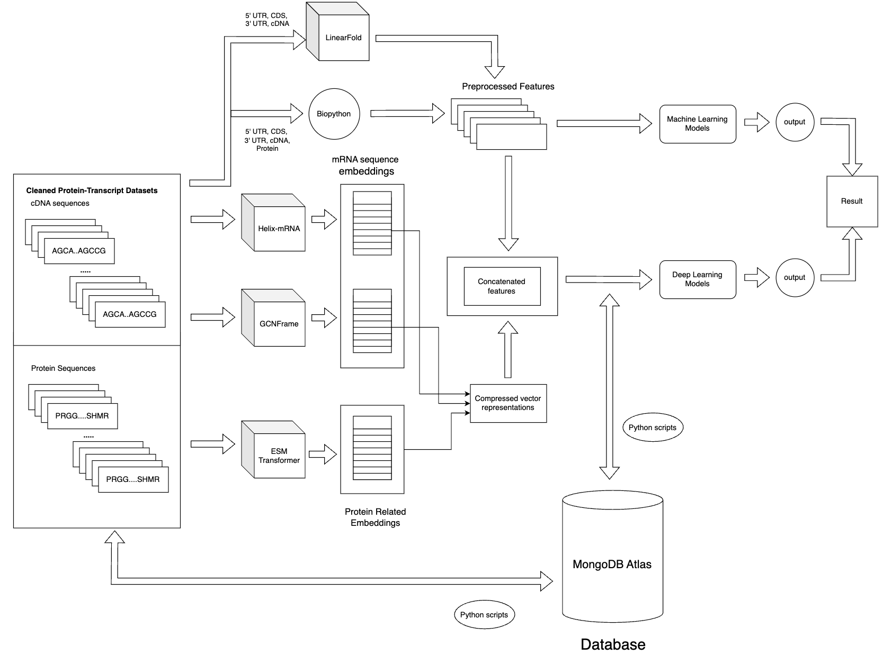
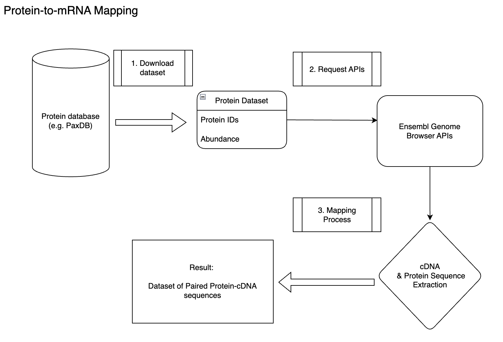
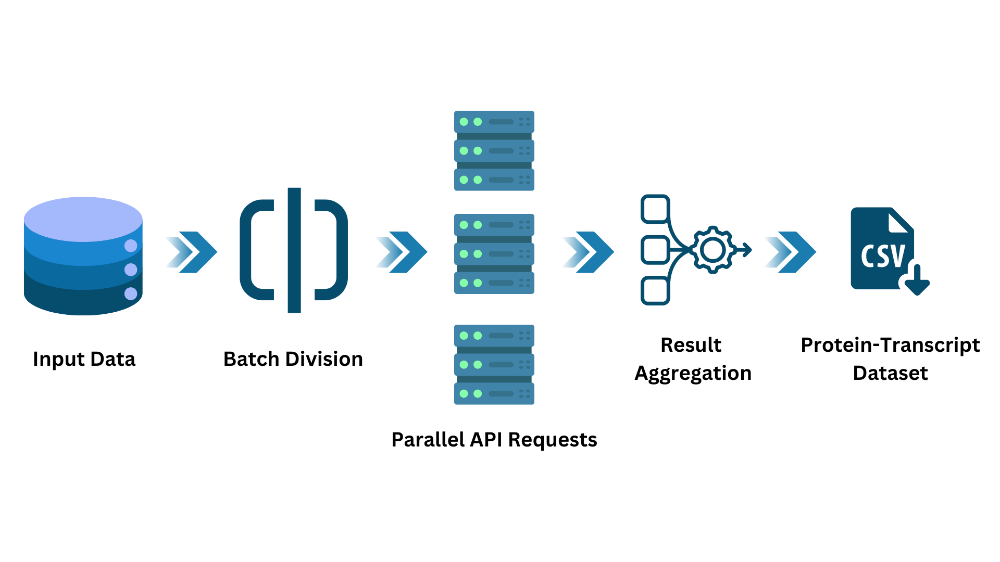
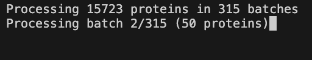
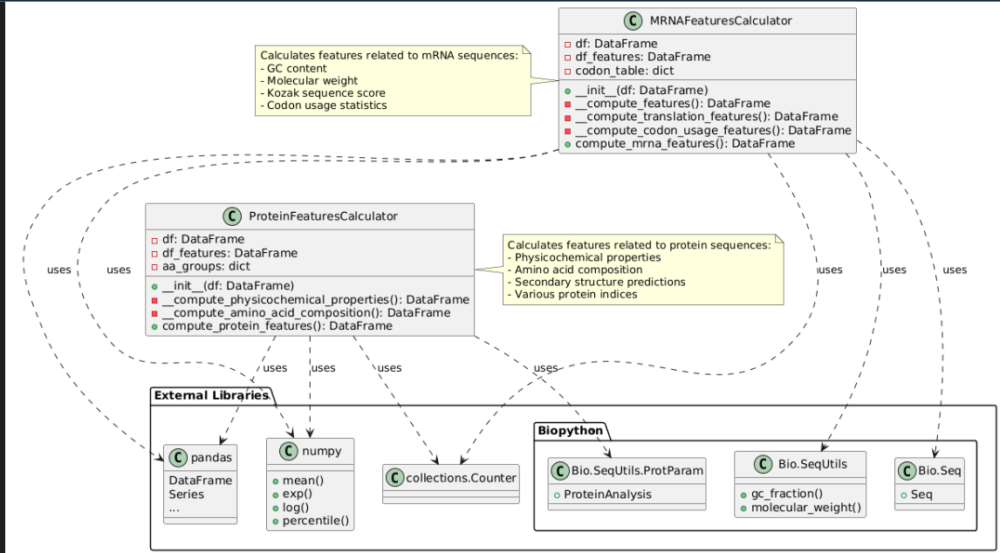
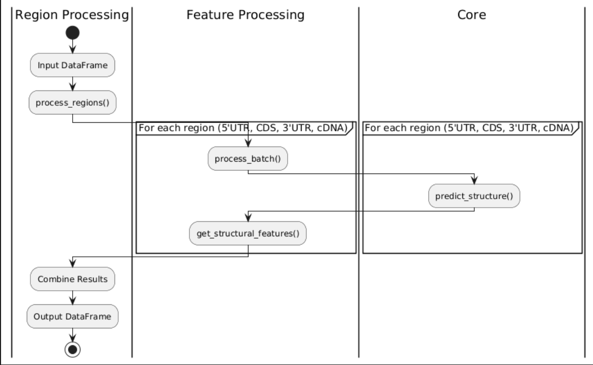
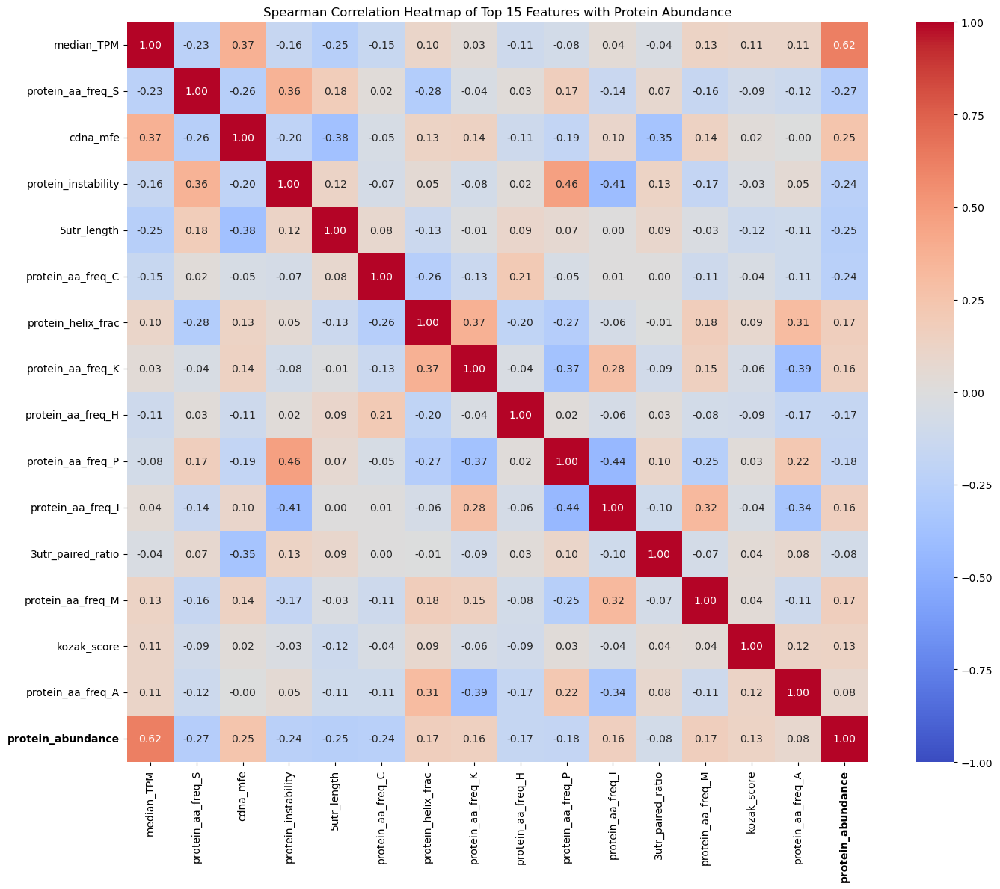
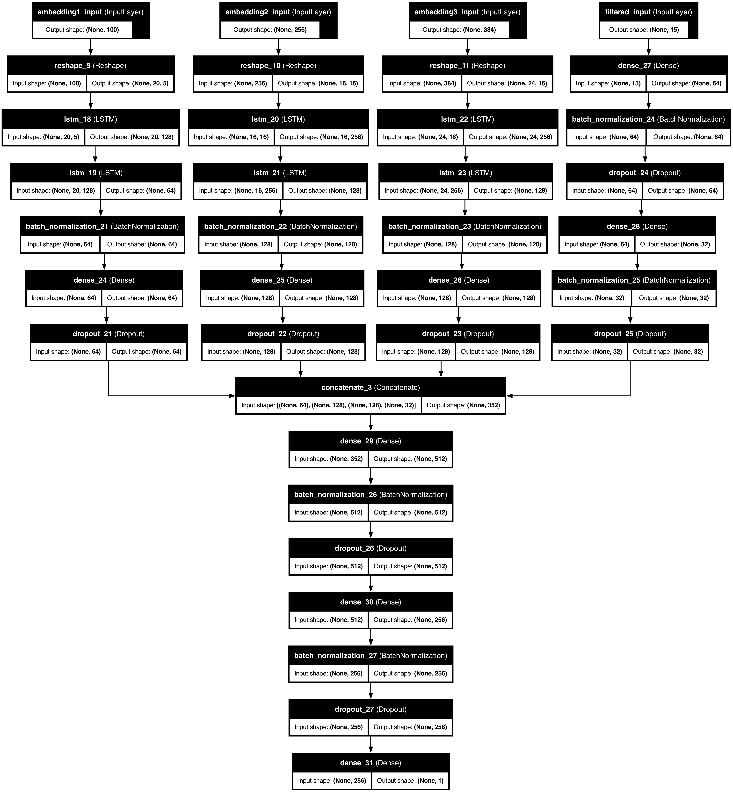

# 1. Introduction

This project researched on various models and develop a predictive approach in predicting tissue-specific protein abundance in humans with the combination of mRNA and protein features. This project utilized integrated human liver tissue expression data and researched various models capabilities by comparing performance metrics to ultimately contributing to inherently more effective mRNA vaccine designs and tackling mRNA design bottlenecks. This project focused on incorporating mRNA and protein datasets, traditional machine learning methods for baseline, and deep-learning-based models for performance comparisons.



This project has successfully achieved prediction performance of R² score of 0.50 for protein abundances in human liver tissue with XGBoost and Multimodal LSTM based on sequence & expression features only, signifying the ability to capture relevant patterns in the underlying complex biological mechanisms.


# 2. Pre-requisites

1. Download Human Protein Abundance Dataset from [PaxDB database](https://pax-db.org/downloads/5.0/datasets/9606/9606-LIVER-integrated.txt) --> Place into PaxDB directory
2. Download GTEx [Transcript TPMs](https://www.gtexportal.org/home/downloads/adult-gtex/bulk_tissue_expression) dataset and Sample Attributes DS [Metadata](https://www.gtexportal.org/home/downloads/adult-gtex/metadata) --> Place into GTEx directory
3. Copy envrionment variables

    `cp .env.development .env`

# 3. Install packages
```
pip install -r requirements.txt
```

# 4. Folder Structure
```
.
├── .DS_Store
├── .gitignore
├── 0_data_extraction_parallel.py
├── 1_data_cleaning.ipynb
├── 2_biopython_features.ipynb
├── 3_Features_Preprocessing.ipynb
├── 4_Concatenate_Features.ipynb
├── 5_ML_Models.ipynb
├── 6_DL_Models.ipynb
├── 7_Demonstration.ipynb
├── Final_Report_Results_Reference.ipynb
├── ProtAbRegressor_multimodal_lstm.keras
├── ProtAbRegressor_xgboost.pkl
├── Protein Embeddings
│   └── ESMFold_Structure_Embeddings_Extraction.ipynb
├── Sequence_Embeddings
│   └── mRNA_Sequence_Embeddings
│       ├── GP-GCN
│       │   ├── cdna_data
│       │   │   └── liver_cdna.fasta
│       │   └── gcnframe.ipynb
│       ├── Helix-mRNAs
│       │   └── Helix_MRNA.ipynb
│       └── Linear_Fold
│           └── LinearFold_features.ipynb
└── modules
    ├── FeaturesCalculator.py
    └── MongoDBScripts.py
```

# 5. Results Demonstration

Demonstration results can be found [here](FYP/7_Demonstration.ipynb)


# 6. Project Execution Steps (End-to-end)

1. Data Extraction Parallel [File](FYP/0_data_extraction_parallel.py)

    Design:
    

    Implementation: 
    

    Result: 
    

2. Features Computation 
    
    [Biopython](FYP/2_biopython_features.ipynb)

    

    [LinearFold](FYP/Sequence_Embeddings/mRNA_Sequence_Embeddings/Linear_Fold/LinearFold_features.ipynb)

    

3. Embeddings Construction:

    - [ESMFold notebook](FYP/Protein%20Embeddings/ESMFold_Structure_Embeddings_Extraction.ipynb)
    - [Helix-mRNA notebook](FYP/Sequence_Embeddings/mRNA_Sequence_Embeddings/Helix-mRNA/Helix_MRNA.ipynb)
    - [GCNFrame notebook](FYP/Sequence_Embeddings/mRNA_Sequence_Embeddings/GP-GCN/gcnframe.ipynb)

4. Features Preprocessing:

    [Exploratory Data Analysis & Features Selection](FYP/3_Features_Preprocessing.ipynb)

    

5. Prediction Models:

    - [Machine Learning Models](FYP/5_ML_Models.ipynb)
    - [Multimodal Deep Learning Models](FYP/6_DL_Models.ipynb)

    Neural Network Architecture:

    Embedding 1: GCNFrame (100-dim)

    Embedding 2: Helix-mRNA (256-dim)

    Embedding 3 2: ESMFold Trunk (384-dim)

    
