# 1. A Multimodal framework for protein abundance prediction in humans

This project researched on various models and developed a novel multimodal approach in human tissue protein abundance prediction by combining mRNA and protein features. This project utilized human liver tissue expression data (integrated) and evaluated performance metrics from baseline to advanced models, ultimately contributing to inherently more effective mRNA vaccine designs.

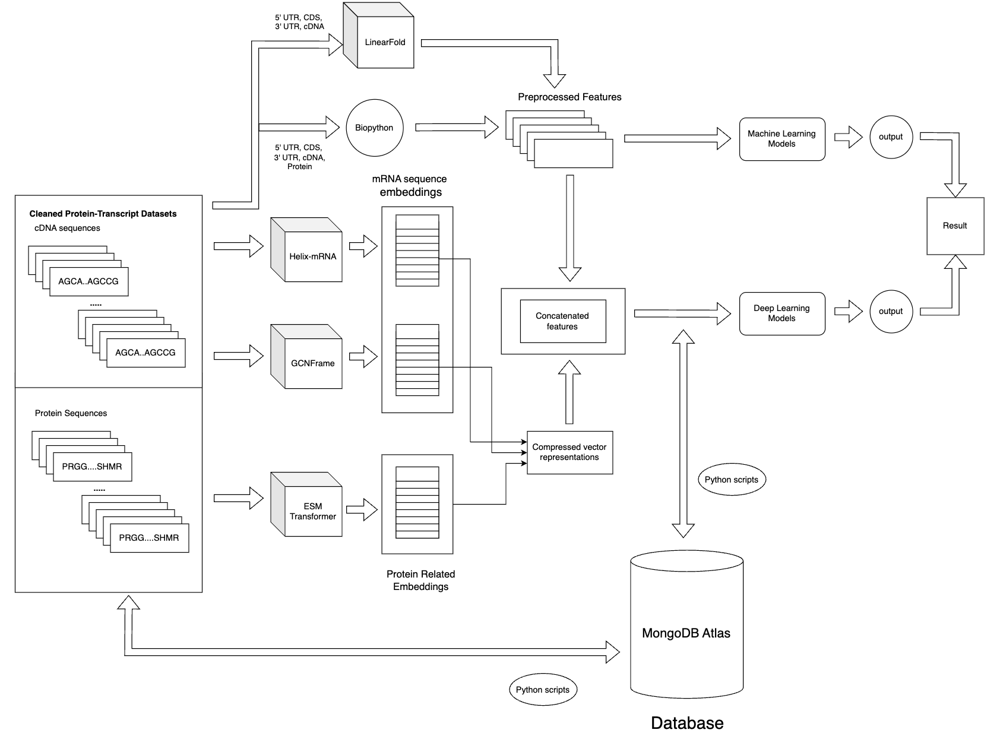

Through transfer learning approaches, the Multimodal LSTM has successfully achieved **R² score performance of 0.5026** on test partition in human liver tissue protein abundances based on sequence & expression features. Thus, signifying the ability to capture relevant patterns in the underlying complex biological mechanisms and competitiveness to modern researches. The model development followed a systematic progression through multiple approaches:

- Starting with a simple linear regression baseline (R² = 0.38)
- Advancing to Random Forest which improved performance (R² = 0.47)
- Further enhancement with XGBoost (R² = 0.5011)
- Finally achieving the best performance with Multimodal LSTM (R² = 0.5026)
- Each iteration demonstrated meaningful improvements in prediction accuracy, with the final Multimodal LSTM showing a 32.3% improvement over the baseline.


# 2. Pre-requisites

1. Clone Repository
```
git clone https://github.com/alvintho/FYP-ProtAbRegressor-Human-Liver.git
```

2. Download Human Protein Abundance Dataset from [PaxDB database](https://pax-db.org/downloads/5.0/datasets/9606/9606-LIVER-integrated.txt) --> Place into PaxDB directory
3. Download GTEx [Transcript TPMs](https://www.gtexportal.org/home/downloads/adult-gtex/bulk_tissue_expression) dataset and Sample Attributes DS [Metadata](https://www.gtexportal.org/home/downloads/adult-gtex/metadata) --> Place into GTEx directory
4. Copy environment variables & setup on request

    `cp .env.development .env`

# 3. Install packages
```
pip install -r requirements.txt
```

# 4. Folder Structure
```
.
├── .DS_Store
├── .gitignore
├── 0_data_extraction_parallel.py
├── 1_data_cleaning.ipynb
├── 2_biopython_features.ipynb
├── 3_Features_Preprocessing.ipynb
├── 4_Concatenate_Features.ipynb
├── 5_ML_Models.ipynb
├── 6_DL_Models.ipynb
├── 7_Demonstration.ipynb
├── Final_Report_Results_Reference.ipynb
├── ProtAbRegressor_multimodal_lstm.keras
├── ProtAbRegressor_xgboost.pkl
├── Protein Embeddings
│   └── ESMFold_Structure_Embeddings_Extraction.ipynb
├── Sequence_Embeddings
│   └── mRNA_Sequence_Embeddings
│       ├── GP-GCN
│       │   ├── cdna_data
│       │   │   └── liver_cdna.fasta
│       │   └── gcnframe.ipynb
│       ├── Helix-mRNAs
│       │   └── Helix_MRNA.ipynb
│       └── Linear_Fold
│           └── LinearFold_features.ipynb
└── modules
    ├── FeaturesCalculator.py
    └── MongoDBScripts.py
```

# 5. Results

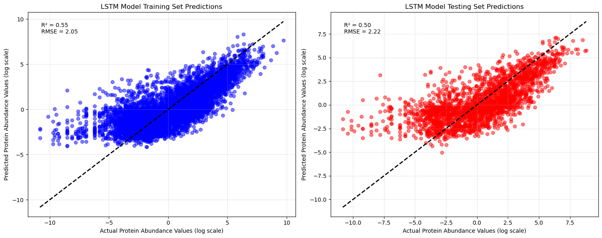

Final report results reference [notebook.](Final_Report_Results_Reference.ipynb)

Demonstration results can be found in this [notebook.](7_Demonstration.ipynb)

Traning output is shown below (Multimodal LSTM):
```
Epoch 1/150
173/173 ━━━━━━━━━━━━━━━━━━━━ 27s 117ms/step - loss: 21.4414 - r2_score: -0.0593 - val_loss: 16.7198 - val_r2_score: 0.3765 - learning_rate: 0.0020
Epoch 2/150
173/173 ━━━━━━━━━━━━━━━━━━━━ 24s 142ms/step - loss: 16.3023 - r2_score: 0.3312 - val_loss: 13.7580 - val_r2_score: 0.4589 - learning_rate: 0.0020
    ..
    ..
    ..
Epoch 76/150
173/173 ━━━━━━━━━━━━━━━━━━━━ 25s 144ms/step - loss: 4.6736 - r2_score: 0.5227 - val_loss: 5.1233 - val_r2_score: 0.5018 - learning_rate: 1.6000e-05
Epoch 77/150
173/173 ━━━━━━━━━━━━━━━━━━━━ 27s 155ms/step - loss: 4.6118 - r2_score: 0.5291 - val_loss: 5.1237 - val_r2_score: 0.5017 - learning_rate: 1.6000e-05
Epoch 77: early stopping
Restoring model weights from the end of the best epoch: 69.
173/173 ━━━━━━━━━━━━━━━━━━━━ 6s 32ms/step
74/74 ━━━━━━━━━━━━━━━━━━━━ 2s 30ms/step
```
The model with best validation R² score will be saved as `ProtAbRegressor_multimodal_lstm.keras`

# 6. System Design & Methodologies

### 1. [Parallel Data Extraction Pipeline](0_data_extraction_parallel.py)

Data Collection Pipeline Design:
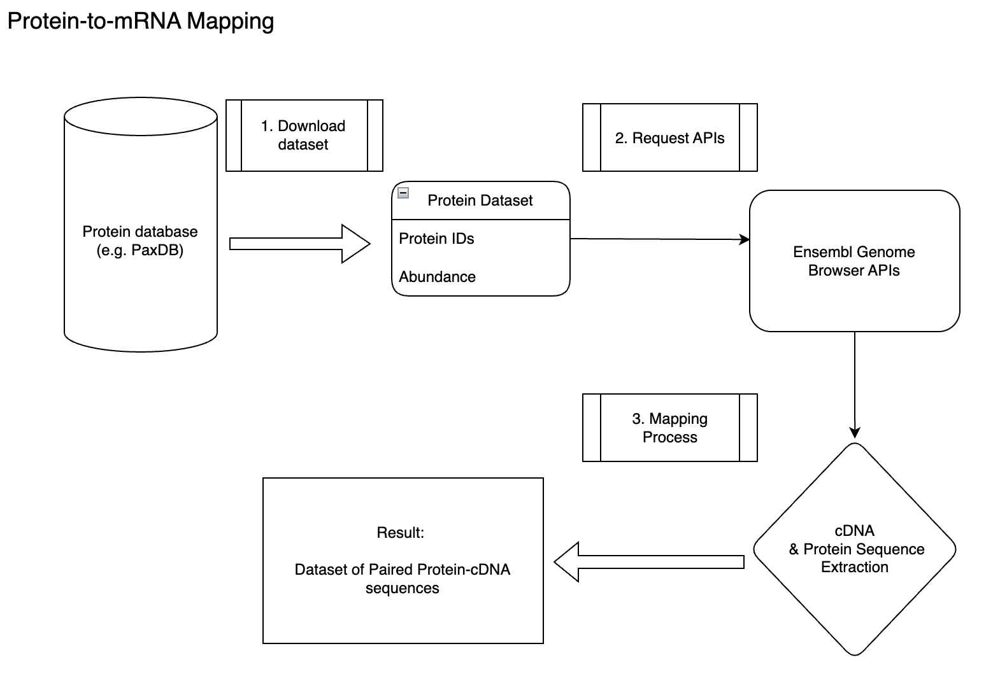

Implementation: 
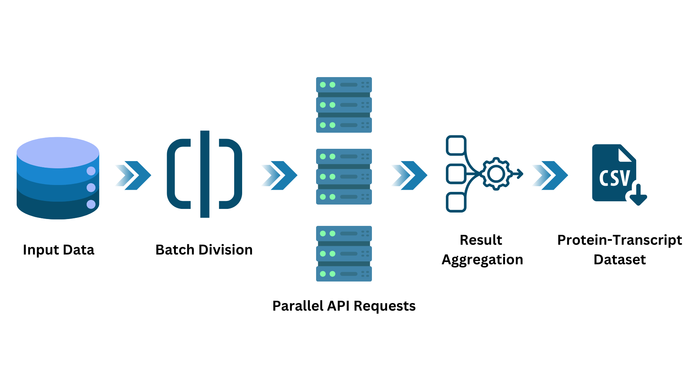

Result: 

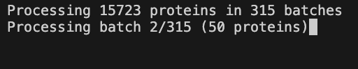


### 2. [Data Cleaning & Quality Control Pipeline](1_data_cleaning.ipynb)

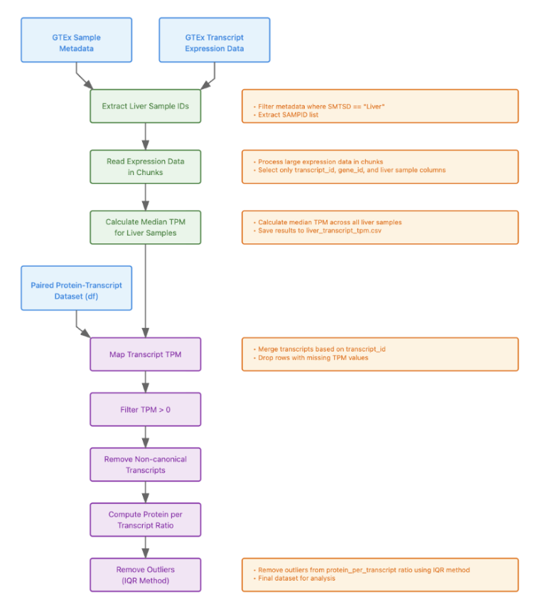

### 3. Features Computation
    
- [Biopython](2_biopython_features.ipynb)

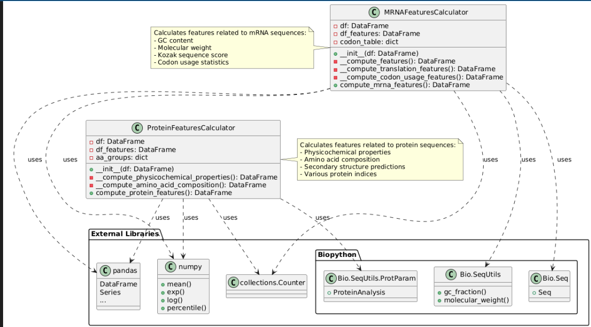

- [LinearFold](Sequence_Embeddings/mRNA_Sequence_Embeddings/Linear_Fold/LinearFold_features.ipynb)

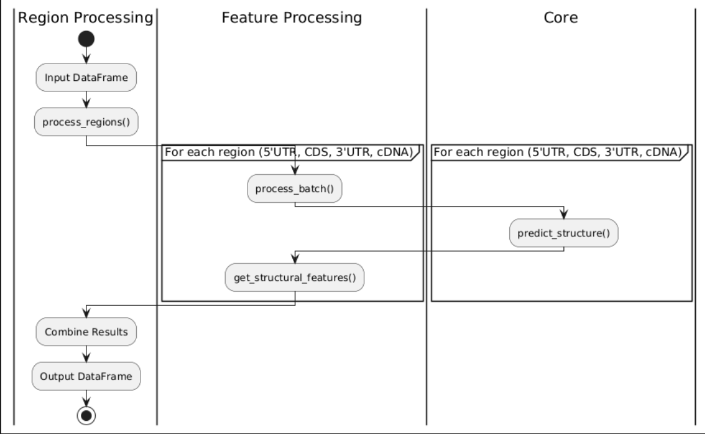

### 4. Embeddings Construction:

- [ESMFold notebook](Protein%20Embeddings/ESMFold_Structure_Embeddings_Extraction.ipynb)
- [Helix-mRNA notebook](Sequence_Embeddings/mRNA_Sequence_Embeddings/Helix-mRNA/Helix_MRNA.ipynb)
- [GCNFrame notebook](Sequence_Embeddings/mRNA_Sequence_Embeddings/GP-GCN/gcnframe.ipynb)

### 5. Features Preprocessing:

[Exploratory Data Analysis & Features Selection](3_Features_Preprocessing.ipynb)

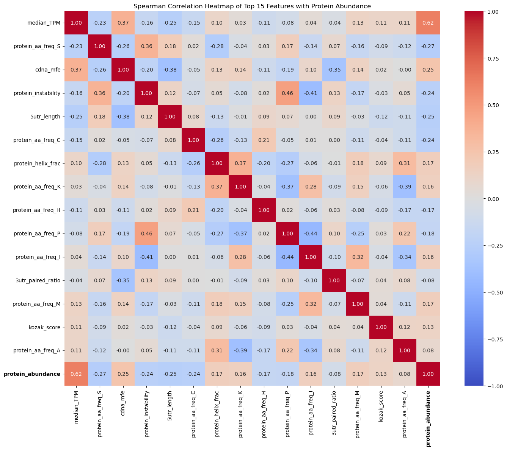

### 6. Prediction Models:

- [Machine Learning Models](5_ML_Models.ipynb)
- [Multimodal Deep Learning Models](6_DL_Models.ipynb)

Multimodal Neural Network Architecture:

Embedding 1: GCNFrame (100-dim)

Embedding 2: Helix-mRNA (256-dim)

Embedding 3 2: ESMFold Trunk (384-dim)

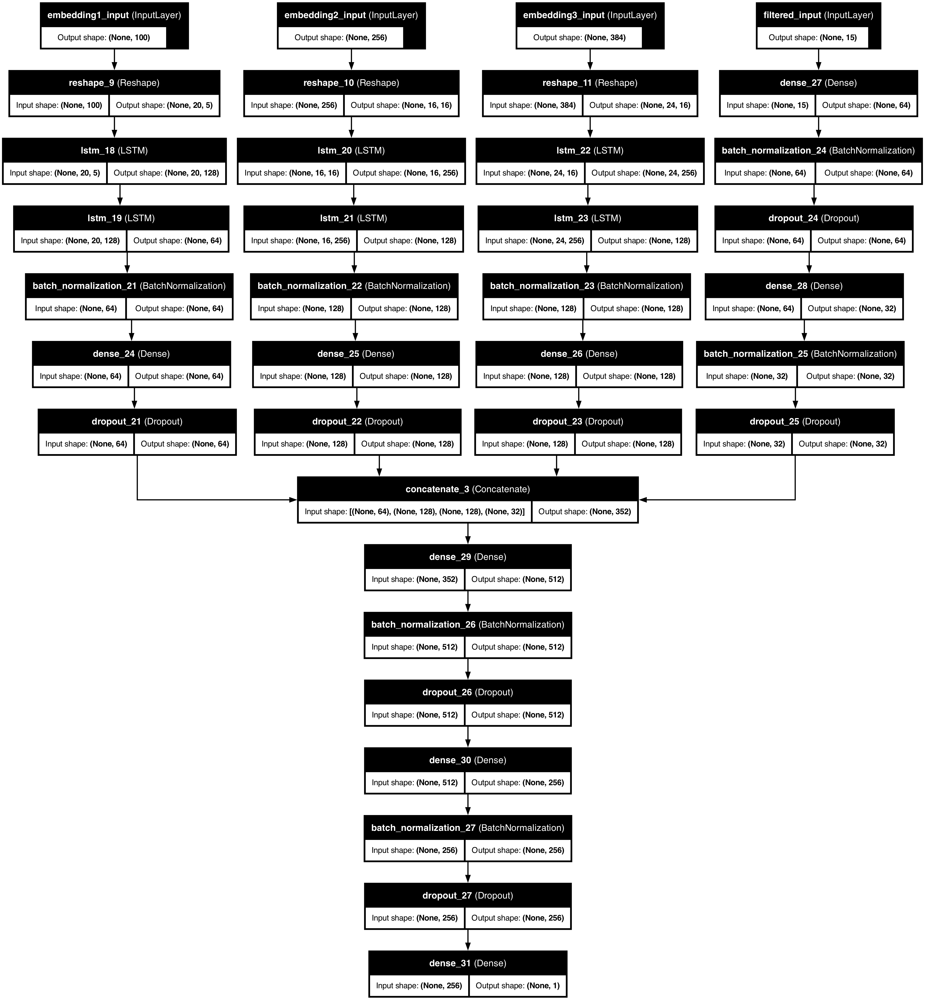

### 7. MongoDB Database

- Cleaned Pairwise Protein-Transcript Dataset Information
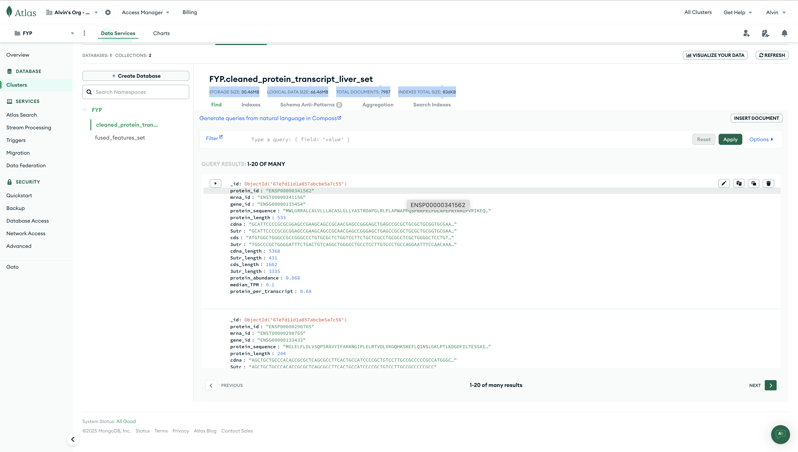

- Concatenated Features Set (LF+BP+GCNFrame+Helix-mRNA+ESMFold)
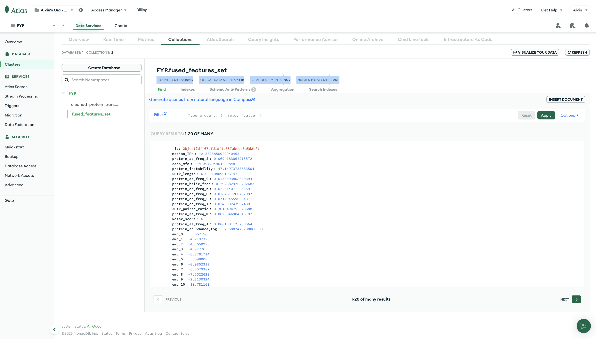

7. Maintainer:

    Name: Alvin Tho

    Email: athosatri2-c@my.cityu.edu.hk
